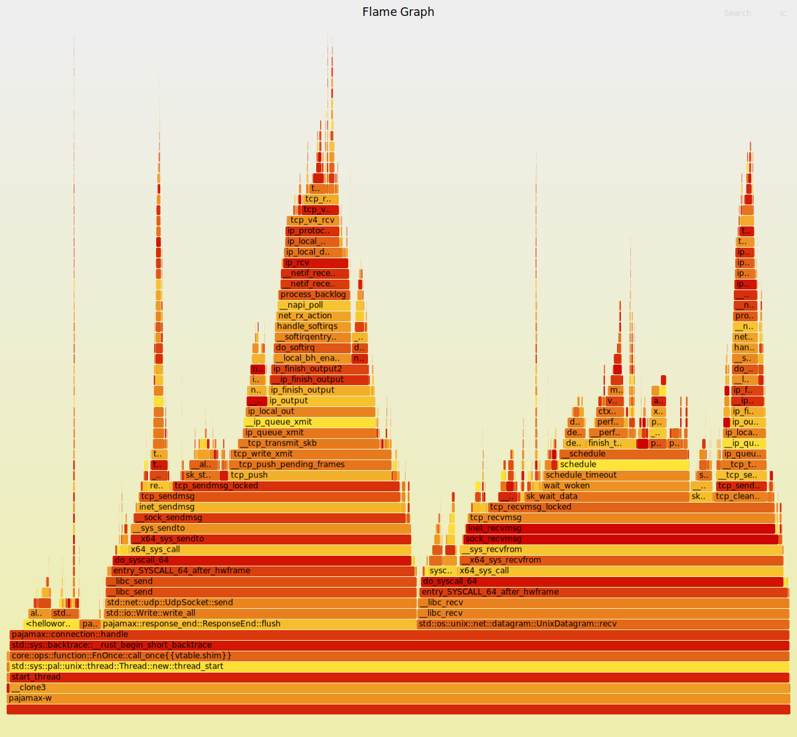
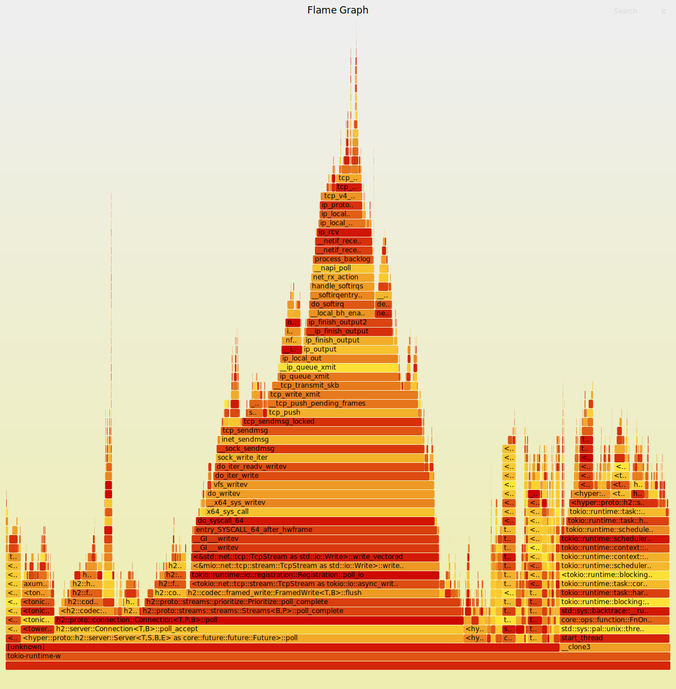

# Directions

CPU: AMD EPYC 9754 128-Core Processor, 16 cores

Tonic server: tonic's [`helloworld`](https://github.com/hyperium/tonic/blob/master/examples/src/helloworld/server.rs)
exmaple with the changing to specify the number of tokio workers.
We only test 1 worker case here.

Pajamx server: pajamax's [`helloworld`](https://github.com/WuBingzheng/pajamax/blob/main/examples/src/helloworld.rs) example.

Bench client `ghz` command line:

```
ghz --proto=proto/helloworld.proto --call helloworld.Greeter/SayHello --insecure 127.0.0.1:50051 --cpus 12 -z1m
```

Since the 2 servers are both much faster than client, we set 12 CPUs for
client and 1 CPU for servers.
For the `ghz` client we use `--cpus 12`.
For the tonic-server, we set 1 tokio worker in the code.
For the pajamax-server, it creates 1 thread for each connection and
`ghz` uses 1 connection in default.

# Result

The full result: [tonic](./tonic.ghz.out) and [pajamax](./pajamax.ghz.out).

The summanry:

```
        | client | server |    r/s
        |  CPU % |  CPU % |
--------+--------+--------+-----------
tonic   |   790% |    95% |  41124.74
pajamax |  1100% |    15% |  65135.31
```

We can say that pajamax is `(65135.31/15%) / (41124.74/95%)` = 9.5X faster that tonic.

# Frame Graphs

The :

- `handle()`, 7.09%, construct the response, mostly the string formating and gRPC encoding (protobuf and http2),
- `find_path()`, 2.60%, process the request, mostly the `:path` header,
- `flush()`, 40.32%, the send() syscall,
- `recv()`, 47.55%, the recv() syscall.

The :

- `poll_read()`, 1.60%, the recv() syscall,
- `flush()`, 38.11%, the send() syscall,
- others, mostly tokio runtime and protocol process (protocol and http2).


- recv() syscall is 
